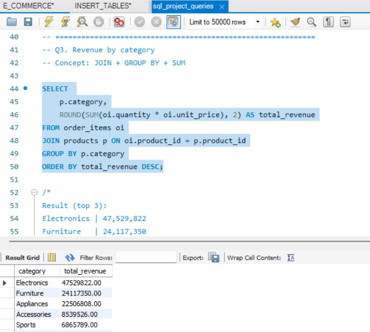
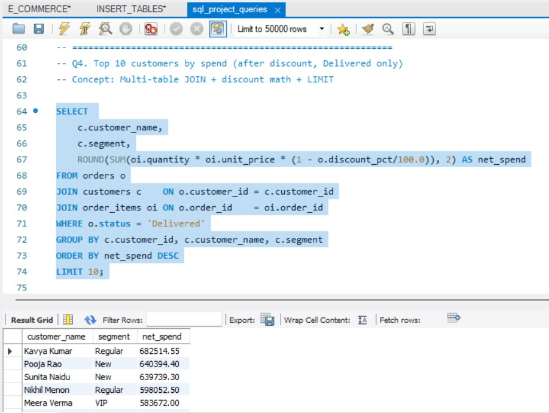
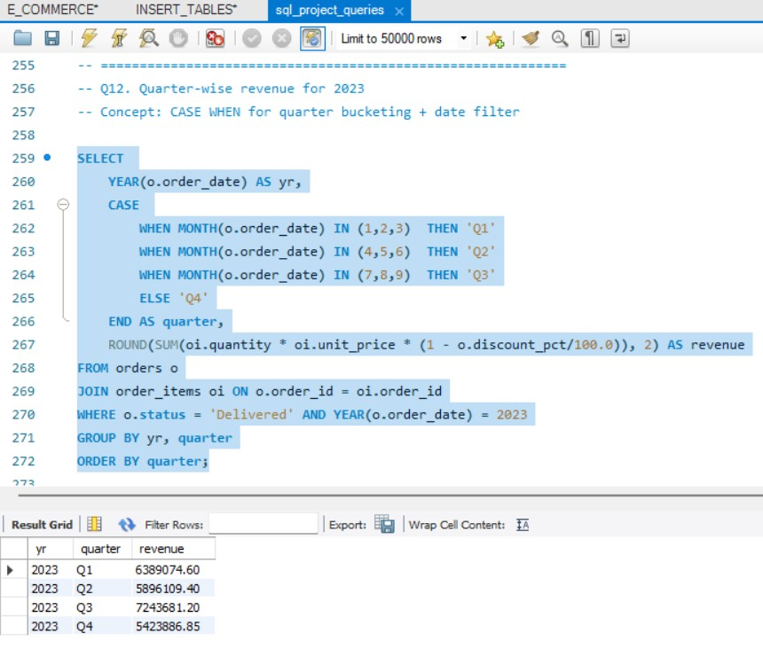

# SQL Data Analytics Project

## Project Overview
This project analyzes an E-commerce dataset using SQL.

## Business Problems Solved

1. Customers by Segment
2. Orders by Status
3. Revenue by Category
4. Top Customers by Spend
5. Yearly Revenue Analysis
6. Top Cities by Revenue
7. Average Order Value by Payment Mode
8. Duplicate Customer Detection
9. Customer Churn Analysis
10. Profit Margin Classification
11. Customers Who Never Returned Products
12. Quarter-wise Revenue Analysis

## SQL Concepts Used

- GROUP BY
- ORDER BY
- JOINS
- Aggregate Functions
- CASE Statements
- Subqueries

## Tools Used

- MySQL
- SQL
- GitHub

## Key Insights

- Electronics generated the highest revenue.
- Q3 recorded the highest sales in 2023.
- Net Banking users had the highest AOV.
- 222 customers churned between 2023 and 2024.

## Query Results

### Revenue Analysis

### Top Customers

### Quarter-wise revenue for 2023

## Project Structure

- Dataset
- Results
- SQL Queries

## Author

Sumanth Akarapu
